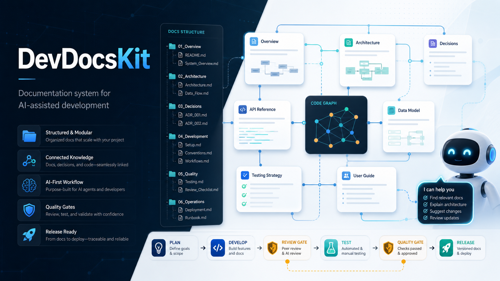

# DevDocsKit



DevDocsKit 是一套面向 AI 辅助开发的标准化开发文档体系，适用于个人项目、团队项目、代码审核、测试验收、发布治理、设计参考沉淀和 AI 编程协作。

目标是把需求、架构、模块拆分、开发阶段、代码审核、Issue 报告、测试覆盖率、发布门禁和复盘机制整理成一套可复用的项目工作台。

## 适合谁使用

- 使用 Codex、Claude Code 或 AI Coding Agent 进行开发的个人开发者
- 希望把项目从灵感推进到可维护实现的小团队
- 需要统一 PRD、技术架构、实施计划、测试验收和发布流程的团队
- 希望在 AI 高速生成代码时保持工程质量、可追踪性和安全边界的项目
- 需要现代 UI 设计参考和产品体验约束的前端或全栈项目

## 核心能力

- 需求、流程、架构、前后端结构和实施计划文档模板
- 个人开发者版本与团队协作版本的双体系规范
- 阶段性代码审核、标签化 Issue 报告和发布签署机制
- 强制测试、检查和覆盖率要求，覆盖率门槛不低于 80%
- 模块化开发约束，避免 AI 过度超前和一次性堆叠复杂功能
- codegraph 项目梳理规则，用于降低 token 消耗和管理复杂度
- 现代 UI、用户习惯、人性化设计和设计参考资料整理
- `CLAUDE.md` 作为 AI Agent 每次开发前必须阅读的根入口文档

## 仓库结构

```text
DevDocsKit/
├─ README.md
├─ CLAUDE.md
├─ assets/
├─ 01_通用开发规范/
├─ 02_个人开发者规范体系/
├─ 03_团队开发规范体系/
└─ 04_设计参考资料/
```

## 文档分区

### `01_通用开发规范`

所有项目都可以复用的基础规则。

- `01_通用开发规范/01_开发标准文档编写规则.md`
- `01_通用开发规范/02_文档维护SOP.md`
- `01_通用开发规范/03_大型项目开发规范.md`
- `01_通用开发规范/04_独立个人开发者开发规范.md`

### `02_个人开发者规范体系`

适合个人开发者、小型项目、独立产品原型和本地全栈项目。

- `02_个人开发者规范体系/00_总览与使用说明_个人版.md`
- `02_个人开发者规范体系/10_核心规范/`
- `02_个人开发者规范体系/20_模板与检查清单/`
- `02_个人开发者规范体系/30_复盘与治理/`

### `03_团队开发规范体系`

适合团队协作、多人 Review、阶段验收、发布治理和可追踪交付。

- `03_团队开发规范体系/00_总览与使用说明.md`
- `03_团队开发规范体系/10_核心规范/`
- `03_团队开发规范体系/20_模板与门禁/`

### `04_设计参考资料`

用于 UI 风格、产品体验和设计方向参考。这里不是工程规则的主入口。

- `04_设计参考资料/00_索引与提炼/`
- `04_设计参考资料/10_精选品牌参考/`
- `04_设计参考资料/90_外部原始资料/`

## 推荐阅读路径

### 个人项目

1. `02_个人开发者规范体系/00_总览与使用说明_个人版.md`
2. `02_个人开发者规范体系/10_核心规范/01_需求文档_PRD规范_个人版.md`
3. `02_个人开发者规范体系/10_核心规范/06_实施计划与复现_IMPLEMENTATION_PLAN_个人版.md`
4. `02_个人开发者规范体系/10_核心规范/08_测试验收与发布规范_个人版.md`
5. `01_通用开发规范/04_独立个人开发者开发规范.md`

### 团队项目

1. `03_团队开发规范体系/00_总览与使用说明.md`
2. `03_团队开发规范体系/10_核心规范/01_需求文档_PRD规范.md`
3. `03_团队开发规范体系/10_核心规范/03_技术栈与架构_TECH_STACK规范.md`
4. `03_团队开发规范体系/10_核心规范/06_实施计划与复现_IMPLEMENTATION_PLAN_复现规范.md`
5. `03_团队开发规范体系/10_核心规范/08_测试验收与发布规范.md`

### 大型或高风险项目

1. `01_通用开发规范/03_大型项目开发规范.md`
2. `01_通用开发规范/01_开发标准文档编写规则.md`
3. `03_团队开发规范体系/10_核心规范/03_技术栈与架构_TECH_STACK规范.md`
4. `03_团队开发规范体系/10_核心规范/05_后端结构规范_BACKEND_STRUCTURE.md`
5. `03_团队开发规范体系/10_核心规范/08_测试验收与发布规范.md`
6. `03_团队开发规范体系/20_模板与门禁/09_需求到发布追踪矩阵模板.md`

## AI 开发规则摘要

AI Agent 在修改项目或套用本规范前，必须先阅读 `CLAUDE.md`。

核心规则：

- 开发前阅读相关开发文档
- 大范围修改前使用 codegraph 或等效工具梳理项目
- 按模块边界开发，禁止无边界堆叠
- 不得过度超前实现未来功能
- 每个开发阶段完成后必须执行代码审核
- 审核问题必须以打标签的 Issue 方式报告
- 测试、检查和覆盖率不得低于 80%
- UI 默认采用现代、清晰、可访问、符合用户习惯的设计

## English Overview

DevDocsKit is a practical documentation system for AI-assisted software development. It helps solo developers and teams turn ideas into traceable requirements, modular implementation plans, code review gates, testing standards, release discipline, and reusable design references.

It is built for projects that use tools such as Codex, Claude Code, AI coding agents, and human review workflows.

Key principles:

- read the relevant development documents before coding
- use codegraph or equivalent local code indexing before broad code changes
- develop by module boundaries
- avoid overbuilding future features
- run review after each development phase
- report review findings as labeled issues
- keep testing and checking coverage at 80% or higher
- default UI work to modern, clear, accessible, user-centered design

## GitHub About

仓库简介建议使用：

```text
A practical documentation system for AI-assisted development, covering personal projects, team workflows, code review, testing gates, release discipline, and design references.
```

## Suggested Topics

```text
documentation
developer-tools
ai-development
ai-coding
codex
claude-code
software-engineering
project-template
code-review
testing
release-management
developer-workflow
```

## 维护规则

- 通用规则放入 `01_通用开发规范`。
- 个人项目规则放入 `02_个人开发者规范体系`。
- 团队工程规则放入 `03_团队开发规范体系`。
- 设计参考资料放入 `04_设计参考资料`。
- 根目录只保留仓库入口、AI 工具入口和必要资产。

## Changelog

- v2.1.1: Add Chinese-first README with English overview.
- v2.1.0: Rename project presentation to DevDocsKit and rewrite README for GitHub.
- v2.0.0: Restructure top-level directories and split core standards, templates, gates, retrospectives, and design references.
- v1.6.0: Rename the former design standards system to the team development standards system.
- v1.5.0: Add phase review, labeled issue reporting, 80% checking coverage, codegraph usage, modular development, and UI experience rules.
- v1.0.0: Initial documentation workspace.
